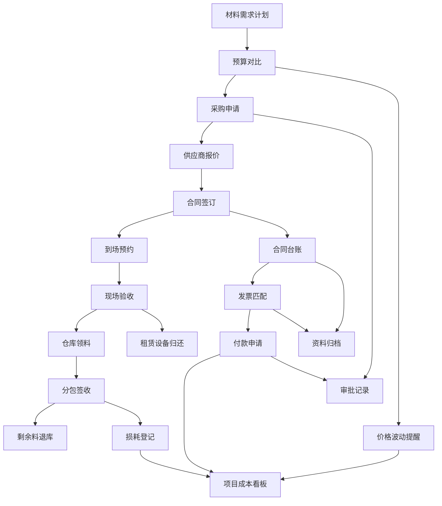

## 1. 产品概述

工程项目供应链物资桌面应用，面向施工单位物资经理、项目仓库和分包队伍，覆盖从材料需求计划到成本分析的物资全生命周期管理，解决施工现场物资流转信息不对称、预算超支难预警、审批流程不透明等核心痛点。

## 2. 核心功能

### 2.1 用户角色

| 角色 | 进入方式 | 核心权限 |
|------|----------|----------|
| 物资经理 | 管理员分配账号 | 预算审批、采购审批、合同签署、成本看板、付款审批 |
| 项目仓库 | 管理员分配账号 | 到场预约确认、现场验收、仓库领料审核、退库接收、损耗登记 |
| 分包队伍 | 管理员分配账号 | 领料申请、分包签收、剩余料退库申请、租赁设备归还 |

### 2.2 功能模块

1. **项目总览页**：项目基本信息、物资流转概况、待办事项、预警提醒、关键指标卡片
2. **计划采购页**：材料需求计划、预算对比、采购申请、供应商报价
3. **到货验收页**：到场预约、现场验收
4. **领退料页**：仓库领料、分包签收、剩余料退库、损耗登记、租赁设备归还
5. **合同费用页**：合同台账、发票匹配、付款申请
6. **成本分析页**：价格波动提醒、项目成本看板、审批记录、资料归档

### 2.3 页面详情

| 页面名称 | 模块名称 | 功能描述 |
|----------|----------|----------|
| 项目总览 | 项目信息卡 | 展示项目名称、编号、工期、参建方等基本信息 |
| 项目总览 | 物资流转概况 | 本月到货/领料/退库数量统计图表 |
| 项目总览 | 待办事项列表 | 按角色展示待审批、待验收、待签收等事项 |
| 项目总览 | 预警提醒 | 预算超支预警、价格波动预警、合同到期提醒 |
| 项目总览 | 关键指标卡片 | 预算执行率、采购完成率、验收合格率、库存周转率 |
| 计划采购 | 材料需求计划 | 按月/按分部工程编制材料需求清单，支持导入Excel |
| 计划采购 | 预算对比 | 需求量与预算量自动对比，超预算高亮标红 |
| 计划采购 | 采购申请 | 从需求计划生成采购申请单，支持多级审批流转 |
| 计划采购 | 供应商报价 | 录入/对比供应商报价，支持按品类比价 |
| 到货验收 | 到场预约 | 供应商/仓管提前预约到场时间和卸货位置 |
| 到货验收 | 现场验收 | 按采购单逐项验收，记录数量差异和质量问题，拍照留证 |
| 领退料 | 仓库领料 | 分包队伍提交领料申请，仓库审核后出库 |
| 领退料 | 分包签收 | 分包队伍确认领料签收，形成签收记录 |
| 领退料 | 剩余料退库 | 分包队伍申请退库，仓库验收后入库 |
| 领退料 | 损耗登记 | 登记材料损耗原因和数量，关联领料记录 |
| 领退料 | 租赁设备归还 | 登记租赁设备归还状态，自动计算租赁费用 |
| 合同费用 | 合同台账 | 合同基本信息、金额、付款进度、变更记录 |
| 合同费用 | 发票匹配 | 采购发票与合同/入库单关联匹配 |
| 合同费用 | 付款申请 | 按合同付款节点发起付款申请，关联发票和验收记录 |
| 成本分析 | 价格波动提醒 | 监控材料价格变动趋势，异常波动自动预警 |
| 成本分析 | 项目成本看板 | 多维度成本分析图表：按品类/按时间/按分包 |
| 成本分析 | 审批记录 | 全流程审批记录查询，支持按时间/类型筛选 |
| 成本分析 | 资料归档 | 合同、发票、验收单等资料电子归档，支持检索下载 |

## 3. 核心流程

物资经理编制材料需求计划，与预算进行对比后生成采购申请，经审批后向供应商询价并签订合同。供应商到场前预约，仓管现场验收。验收合格后入库，分包队伍申请领料并签收确认。施工完成后剩余料退库，损耗登记入账。合同费用按节点付款，发票匹配核销。全程成本数据汇聚至成本看板，价格异常自动预警。

## 4. 用户界面设计

### 4.1 设计风格

- **主色调**：工业蓝(#1B3A5C)为主色，搭配警示橙(#E67E22)作为强调色
- **辅助色**：深灰(#2C3E50)用于侧边栏，浅灰(#ECF0F1)用于背景
- **按钮风格**：圆角矩形，主按钮实色填充，次按钮描边
- **字体**：标题使用 Source Han Sans(思源黑体) Bold，正文使用 Source Han Sans Regular
- **布局风格**：左侧固定侧边导航 + 顶部标题栏 + 右侧内容区，卡片式模块布局
- **图标风格**：线性图标(Lucide)，统一2px描边
- **整体风格**：工业/专业风格，强调数据密度和信息层级，符合施工现场管理场景

### 4.2 页面设计概览

| 页面名称 | 模块名称 | UI要素 |
|----------|----------|--------|
| 项目总览 | 项目信息卡 | 深色卡片，白色文字，右上角项目状态标签 |
| 项目总览 | 物资流转概况 | 柱状图+折线图组合，月度数据切换 |
| 项目总览 | 待办事项列表 | 列表项带角色标签和优先级色条，点击可跳转 |
| 项目总览 | 预警提醒 | 红色/橙色/黄色告警卡片，脉冲动画提示 |
| 项目总览 | 关键指标卡片 | 四宫格卡片，数字大号加粗，环比箭头指示 |
| 计划采购 | 材料需求计划 | 表格布局，支持筛选排序，行内编辑数量 |
| 计划采购 | 预算对比 | 双列对比表格，超预算行红色背景高亮 |
| 计划采购 | 采购申请 | 表单+审批流程条，状态标签颜色区分 |
| 计划采购 | 供应商报价 | 卡片式比价布局，最低价绿色高亮 |
| 到货验收 | 到场预约 | 日历视图+列表切换，时间槽颜色标记 |
| 到货验收 | 现场验收 | 清单式逐项勾选，数量差异红字标注 |
| 领退料 | 仓库领料 | 申请表单+库存实时显示，库存不足红色提示 |
| 领退料 | 分包签收 | 签收单列表，待签收项加粗显示 |
| 领退料 | 剩余料退库 | 退库申请表单，退库原因下拉选择 |
| 领退料 | 损耗登记 | 表格+弹窗录入，损耗率自动计算 |
| 领退料 | 租赁设备归还 | 设备卡片布局，归还状态标签切换 |
| 合同费用 | 合同台账 | 表格布局，合同金额进度条，点击展开详情 |
| 合同费用 | 发票匹配 | 双栏匹配界面，左侧发票列表右侧合同清单 |
| 合同费用 | 付款申请 | 表单+关联记录展示，付款进度环形图 |
| 成本分析 | 价格波动提醒 | 折线图+阈值线，超阈值区域红色填充 |
| 成本分析 | 项目成本看板 | 多维度图表组合：饼图+柱图+趋势线 |
| 成本分析 | 审批记录 | 时间轴布局，审批节点状态标记 |
| 成本分析 | 资料归档 | 文件列表+预览区，支持分类筛选和搜索 |

### 4.3 响应式策略

- 桌面优先设计，最小支持1280px宽度
- 内容区自适应宽度，表格列宽按比例分配
- 侧边栏可折叠，折叠后仅显示图标

### 4.4 动效设计

- 页面切换：淡入淡出过渡(200ms)
- 卡片hover：轻微上浮+阴影加深
- 数据加载：骨架屏占位
- 预警提醒：脉冲呼吸动画
- 审批流程：节点逐步亮起动画
