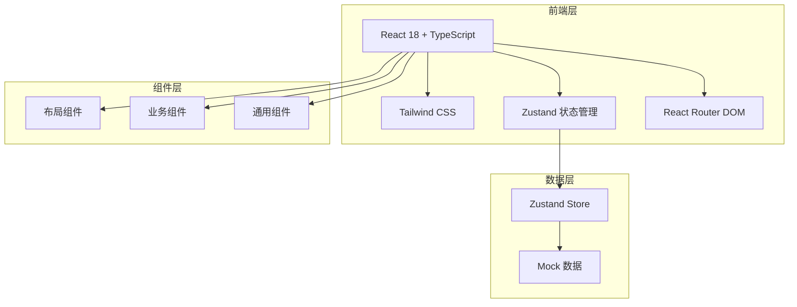
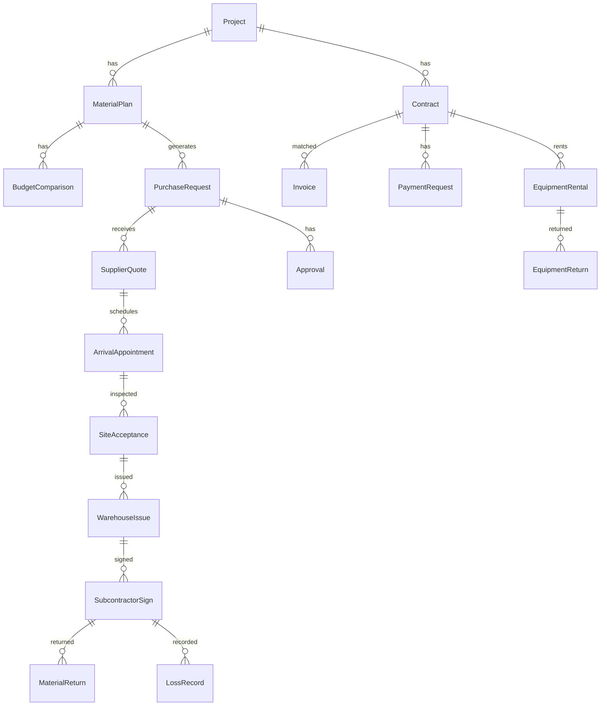

## 1. 架构设计



## 2. 技术说明

- 前端：React@18 + TailwindCSS@3 + Vite
- 初始化工具：vite-init
- 后端：无（纯前端，Mock数据模拟）
- 数据库：无（使用 Zustand Store + Mock 数据）
- 状态管理：Zustand
- 图表库：Recharts
- 图标库：lucide-react
- 路由：react-router-dom v6

## 3. 路由定义

| 路由 | 用途 |
|------|------|
| / | 项目总览页 - 项目信息、物资流转、待办、预警、指标 |
| /plan | 计划采购页 - 需求计划、预算对比、采购申请、供应商报价 |
| /arrival | 到货验收页 - 到场预约、现场验收 |
| /material | 领退料页 - 领料、签收、退库、损耗、设备归还 |
| /contract | 合同费用页 - 合同台账、发票匹配、付款申请 |
| /cost | 成本分析页 - 价格预警、成本看板、审批记录、资料归档 |

## 4. 数据模型

### 4.1 数据模型定义



### 4.2 核心数据结构

```typescript
interface Project {
  id: string;
  name: string;
  code: string;
  startDate: string;
  endDate: string;
  status: "进行中" | "已完工" | "暂停";
  budgetTotal: number;
  spentTotal: number;
}

interface MaterialPlan {
  id: string;
  projectId: string;
  materialName: string;
  specification: string;
  unit: string;
  plannedQty: number;
  budgetQty: number;
  purchasedQty: number;
  usedQty: number;
  month: string;
}

interface PurchaseRequest {
  id: string;
  projectId: string;
  planId: string;
  materialName: string;
  qty: number;
  status: "待审批" | "已审批" | "已驳回" | "已采购";
  createdAt: string;
  approvedBy: string;
}

interface SupplierQuote {
  id: string;
  requestId: string;
  supplierName: string;
  unitPrice: number;
  totalPrice: number;
  deliveryDays: number;
  quoteDate: string;
}

interface Contract {
  id: string;
  projectId: string;
  contractNo: string;
  supplierName: string;
  amount: number;
  paidAmount: number;
  signDate: string;
  status: "履行中" | "已完成" | "已终止";
}

interface ArrivalAppointment {
  id: string;
  contractId: string;
  materialName: string;
  scheduledDate: string;
  scheduledTime: string;
  location: string;
  status: "待确认" | "已确认" | "已到场";
}

interface SiteAcceptance {
  id: string;
  appointmentId: string;
  materialName: string;
  orderedQty: number;
  receivedQty: number;
  qualifiedQty: number;
  issue: string;
  status: "合格" | "部分合格" | "不合格";
}

interface WarehouseIssue {
  id: string;
  acceptanceId: string;
  subcontractorName: string;
  materialName: string;
  issuedQty: number;
  issuedDate: string;
  status: "待审核" | "已出库";
}

interface MaterialReturn {
  id: string;
  issueId: string;
  materialName: string;
  returnQty: number;
  reason: string;
  returnDate: string;
  status: "待验收" | "已入库";
}

interface LossRecord {
  id: string;
  issueId: string;
  materialName: string;
  lossQty: number;
  lossRate: number;
  reason: string;
  recordedDate: string;
}

interface Invoice {
  id: string;
  contractId: string;
  invoiceNo: string;
  amount: number;
  issueDate: string;
  matchedStatus: "未匹配" | "已匹配";
}

interface PaymentRequest {
  id: string;
  contractId: string;
  amount: number;
  reason: string;
  status: "待审批" | "已审批" | "已驳回" | "已支付";
  createdAt: string;
}

interface ApprovalRecord {
  id: string;
  relatedType: string;
  relatedId: string;
  action: "提交" | "审批通过" | "驳回";
  operator: string;
  role: string;
  comment: string;
  createdAt: string;
}
```
